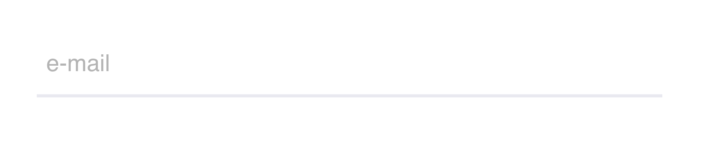
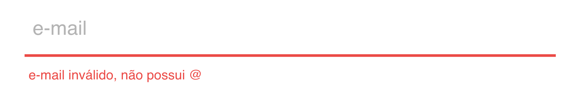
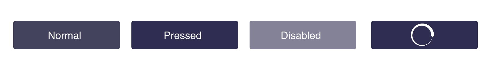

# Teste de Front-end - Nível 1 | E-thinkers 
Este teste é apresentado aos candidatos as vagas de desenvolvimento Front-end Nível 1 para avaliar os quesitos técnicos.

### O Desafio

Seu objetivo é criar um simples app que que exibe um formulário com os campos abaixo, respeitando fielmente a aparência e sendo responsivo.

* Nome
* Sobrenome
* CPF
* Telefone
* Email

### Pré-requisitos: 
 - Os inputs de texto e botão devem ter a aparência conforme o guia de estilo abaixo;
 - Fazer com JS a validação do campo de e-mail, conforme guia de estilo;
 - A página ser responsiva;
 - Publicar o resultado do teste no GITHUB;

## Guia de estilo

### Input:
 - Cor da fonte sem foco: *#afafaf*.
 - Cor da fonte com foco: *#43425D*.
 - Cor da borda: *#E9E9F0*.

### Input Inválido:
 - Cor da fonte: *#eb4a46*.
 - Cor da borda: *#eb4a46*.

### Botão Habilitado:
 - Cor da fonte com foco: *#ffffff*.
 - Cor de background: *#2F2E50*.

### Botão Hover:
 - Opacidade do botão com hover: 70%.

### Botão Desabilitado:
 - Cor da fonte sem foco: *#dddcdc*.
 - Cor de background: *#838296*.

### Botão Loading:
**Criar animação de loading ao clicar no submit*

### Exemplo final

